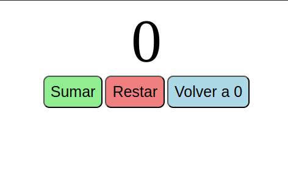

# Contador Web

Este proyecto es un contador web simple desarrollado utilizando HTML, CSS y JavaScript.

## Funcionalidades

El contador web permite realizar las siguientes operaciones:

- **Sumar:** Incrementa el valor del contador en 1 unidad.
- **Restar:** Decrementa el valor del contador en 1 unidad.
- **Resetear:** Establece el contador de nuevo a 0.

## Tecnologías utilizadas

El proyecto está construido utilizando las siguientes tecnologías:

- **HTML:** Utilizado para la estructura básica del contador web.
- **CSS:** Estilos para darle formato y diseño al contador.
- **JavaScript:** Funcionalidad para implementar las operaciones de sumar, restar y resetear el contador.

## Uso

Para utilizar el contador, simplemente abre el archivo `index.html` en tu navegador web preferido y podrás interactuar con las opciones de sumar, restar y resetear el contador.
